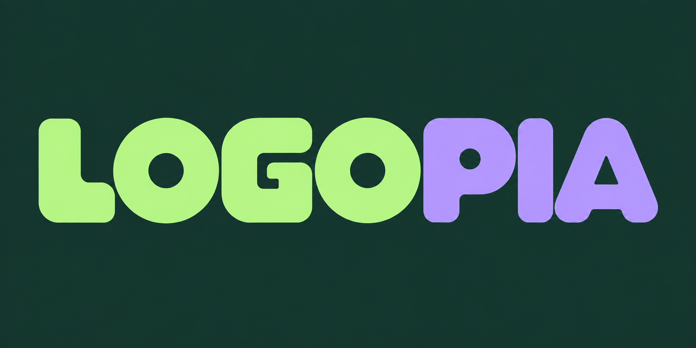

<p align="center">
  <a href="docs/brand/README.ko.md"></a>
</p>

<a id="logo-land-로고랜드"></a><a id="logopia"></a>
<h1 align="center">Logopia · 로고피아</h1>

<p align="center">
  <strong>이름에 어울리는 모양을 만들어 보세요.</strong><br>
  Codex와 대화하며 개성 있는 레터링, 브랜드 로고와 앱 아이콘 아트워크를 만드실 수 있습니다.
</p>

<p align="center">
  <a href="https://github.com/t1seo/logopia/releases/tag/v0.7.0"></a>
  
  
</p>

<p align="center">
  <a href="README.md">English</a> · <a href="README.ko.md">한국어</a> · <a href="#설치">시작하기</a> · <a href="docs/gallery.ko.md">갤러리</a> · <a href="docs/README.ko.md">문서</a>
</p>

<a id="샘플"></a><a id="샘플-10개"></a><a id="투명-배경-로고"></a>

## 이런 디자인을 만드실 수 있습니다

여러 색을 쓴 경쾌한 워드마크부터 속도감 있는 레터링, 기하학적인 이니셜과 작은 캐릭터까지 살펴보세요. 2026년 9월 쇼케이스는 가상 브랜드 10개와 앱 아이콘 예제 6개를 한 장에 담았습니다.

<p align="center">
  <a href="assets/logopia-showcase.png"></a>
</p>

[**쇼케이스 보드 크게 보기 →**](assets/logopia-showcase.png) · [현재 갤러리](docs/gallery.ko.md#showcase) · [개별 PNG 다운로드](docs/showcase/2026-09/README.ko.md)

<a id="시작하기"></a><a id="저장소에서-바로-사용"></a><a id="이미지-생성과-파일-보조-도구의-차이"></a>

## 설치

**이미지 생성·편집 도구가 있는 Codex**, **Python 3.12 이상**, **uv**가 필요합니다. 이미지 도구가 그림을 만들고, 로컬 보조 도구는 프로젝트 저장·프롬프트 준비·파일 패키징을 맡습니다. 플러그인을 설치해도 없는 이미지 도구가 활성화되지는 않습니다.

```sh
git clone https://github.com/t1seo/logopia.git
cd logopia
uv sync --locked
codex
```

열린 Codex 대화에서 이렇게 시작해 주세요.

> skills/logo-land/SKILL.md를 읽고 따라 주세요. LUMA의 경쾌한 다색 워드마크를 만들어 주세요. 정확한 글자는 LUMA이며, 글자 자체가 디자인이 되도록 하고 별도 아이콘이나 슬로건은 넣지 말아 주세요.

<a id="codex-플러그인으로-설치"></a>

**다른 프로젝트에서 `$logo-land`를 사용하시려면** [전체 플러그인 설치 안내](docs/installation.ko.md)를 따라 주세요. 로컬 마켓플레이스 설정, 업데이트와 프로젝트 저장 위치를 설명합니다. 스킬 호출명은 기존 `$logo-land`를 사용합니다.

<a id="릴리스와-버전-관리"></a>

버전은 **0.7.0**입니다. [릴리스 안내](https://github.com/t1seo/logopia/releases/tag/v0.7.0) · [변경 이력](CHANGELOG.md)

<a id="대화로-사용하기"></a>

## 이렇게 요청해 보세요

**글자부터 시작해 보세요.** 워드마크는 브랜드 이름 자체를 로고로 만든 디자인입니다. 원하는 글자 모양과 리듬, 분위기를 설명하고 표기를 정확하게 적어 주세요.

> $logo-land LOOP LAB의 굵고 경쾌한 워드마크를 만들어 주세요. 여러 밝은 색, 둥근 글자와 생동감 있는 간격을 사용해 주세요. 정확한 글자는 LOOP LAB이며, 아이콘이나 슬로건은 추가하지 말아 주세요.

> $logo-land KITE의 속도감 있는 스포츠 워드마크를 만들어 주세요. 앞으로 기울어진 맞춤 글자와 날카로운 절개를 사용해 주세요. 정확한 글자 KITE만 넣고, 연 모양 심볼은 넣지 말아 주세요.

> $logo-land 물결의 한글 워드마크를 만들어 주세요. 정확한 글자는 물결이며, 굵고 둥근 글자에 민트와 라일락을 사용해 주세요. 한글이 또렷하게 읽히도록 하고, 별도의 파도 아이콘이나 문구는 넣지 말아 주세요.

**작은 마크와 캐릭터도 요청하실 수 있습니다.**

> $logo-land NORTHLINE의 이니셜 NL만 사용해 기하학적인 모노그램을 만들어 주세요. 두 글자가 하나의 세로획을 공유하되, N과 L이 모두 읽히도록 해 주세요.

> $logo-land 책을 읽는 작은 부엉이 앱 아이콘 한 개를 만들어 주세요. 단순하고 통통한 캐릭터를 오른쪽 아래에 배치하고, 캐릭터에는 두 색, 배경에는 한 가지 단색을 사용해 주세요. 글자는 넣지 말아 주세요.

<a id="앱-아이콘-방향-여섯-가지"></a><a id="네-가지-방식으로-색상-정하기"></a><a id="심볼과-정확한-글자-조합하기"></a><a id="로고-유형-8가지"></a><a id="수정과-전달-파일"></a>

<a id="만들-수-있는-것"></a>

## 첫 아이디어부터 전달 파일까지

| 만들 대상 | 시도할 수 있는 방향 |
|---|---|
| **레터링** | 경쾌한 다색·스포츠 워드마크, 기하학적 레터마크와 모노그램, 한글·영문 브랜드명 |
| **브랜드 로고** | 워드마크, 레터마크, 모노그램, 심볼, 추상형, 조합형, 엠블럼, 마스코트 |
| **앱 아이콘 아트워크** | IP 캐릭터, 픽토그램, 추상형, 모노그램, 소프트 3D, 픽셀 아트 |

색을 직접 정하거나 Logopia에 제안을 맡기실 수 있습니다. 저장한 여러 프로젝트의 후보를 비교하고, 마음에 드는 점을 기록한 뒤 원본과 이력을 보존하며 선택한 디자인을 수정해 보세요.

> 후보들을 한 갤러리에서 앱 홈 화면·웹 헤더·16px 크기로 비교해 주세요. 선택한 디자인의 글자와 색은 유지하고, 글자 사이 간격만 넓혀 주세요.

결과는 **래스터 PNG**입니다. 검수를 마친 내보내기에는 원본 PNG, ZIP과 간단한 브랜드 안내가 포함될 수 있습니다. 편집 가능한 벡터와 폰트 파일은 별도 작업이며, 폰트명은 시각적 참고입니다. 앱 아이콘은 플랫폼별 준비가 필요하고, 투명 배경은 별도로 요청하고 확인해야 합니다.

[레터링 안내](skills/logo-land/references/lettering.md) · [후보 비교와 수정](skills/logo-land/references/comparison-workflow.md) · [색상과 글자](docs/colors/README.ko.md) · [투명 PNG 예제](docs/samples/transparency.ko.md) · [이전 샘플 보관 자료](docs/gallery.ko.md#historical-outputs)

<a id="조사와-제작-근거"></a>

## 출처

IP 캐릭터 지침은 [s1dashu/ip-as-logo-skill](https://github.com/s1dashu/ip-as-logo-skill)을 바탕으로 각색했습니다. [고정된 원본과 각색 안내](skills/logo-land/references/ip-mascot.md), [MIT 라이선스 고지](skills/logo-land/assets/ip-as-logo.LICENSE), [제3자 출처 고지](THIRD_PARTY_NOTICES.md)를 확인해 주세요.

[문서](docs/README.ko.md) · [Logopia 로고](docs/brand/README.ko.md) · [도움 요청](https://github.com/t1seo/logopia/issues)
