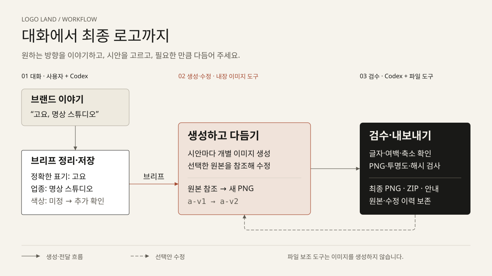

# Logo Land (로고랜드)

[English](README.md) · **한국어**

<p align="center"></p>

[이 로고를 만든 과정](docs/brand/README.md)


**대화로 브랜드를 정리하고 로고를 생성·수정·전달하는 Codex 플러그인입니다.** 브랜드명과 원하는 느낌을 말씀하시면 시안을 비교하고, 선택한 이미지를 다듬어 최종 PNG와 사용 안내를 받을 수 있습니다. 원본과 수정 이력을 저장하므로 다음 대화에서도 이어서 작업할 수 있습니다.



[흐름도와 글 설명 열기](docs/diagrams/workflow.html) · [샘플 10개 갤러리](docs/samples/index.html)

GitHub에서는 HTML 링크가 소스 코드로 열립니다. 저장소를 내려받은 뒤 `docs/diagrams/workflow.html` 또는 `docs/samples/index.html`을 로컬 Chrome에서 열면 완성된 페이지를 보실 수 있습니다. 흐름도와 샘플 PNG는 README에서도 바로 표시됩니다.

## 시작하기

이미지 생성·편집 도구를 사용할 수 있는 Codex 환경이 필요합니다. 플러그인을 설치하는 것만으로 이미지 도구 권한이 생기지는 않습니다. 로컬 파일 관리를 위해 Python 3.12 이상과 `uv`가 필요하며, 플러그인은 별도의 OpenAI API 키나 경쟁 서비스 계정을 요구하지 않습니다.

### 저장소에서 바로 사용

```sh
git clone https://github.com/t1seo/logo-land.git
cd logo-land
uv sync --locked
codex
```

이 폴더를 연 Codex 대화에서 다음처럼 요청하시면 됩니다. 이 방법은 저장소의 스킬 지침을 직접 읽는 방식입니다.

> skills/logo-land/SKILL.md를 읽고 이 스킬에 따라 로고를 만들어 주세요. 브랜드는 고요이고, 명상 스튜디오입니다. 한글과 심볼을 조합한 차분한 시안 두 개를 보고 싶습니다.

### Codex 플러그인으로 설치

설치 명령은 `codex plugin add`입니다. 이 저장소는 플러그인 소스이며, 공개 마켓플레이스 주소나 배포 ZIP을 설치 경로로 제공하지 않습니다. 다음과 같이 자신의 로컬 마켓플레이스에 등록하실 수 있습니다.

1. 위 명령으로 저장소를 내려받고, 그 폴더의 **절대 경로**를 확인합니다.
2. 별도 폴더에 `.agents/plugins/marketplace.json`을 만듭니다. 아래 `path`를 실제 저장소 절대 경로로 바꿉니다. Windows에서도 JSON 경로에 `/`를 쓰실 수 있습니다.

```json
{
  "name": "logo-land-local",
  "plugins": [
    {
      "name": "logo-land",
      "source": {
        "source": "local",
        "path": "/absolute/path/to/logo-land"
      },
      "policy": {
        "installation": "AVAILABLE",
        "authentication": "ON_INSTALL"
      },
      "category": "Productivity"
    }
  ]
}
```

3. `.agents` 폴더를 포함하는 마켓플레이스 루트 경로로 등록한 뒤 설치합니다. 아래 경로도 실제 위치로 바꿉니다.

```sh
codex plugin marketplace add /absolute/path/to/local-marketplace
codex plugin add logo-land@logo-land-local
```

4. **새 Codex 대화**를 열어 `$logo-land`로 시작합니다. 사용 환경에서 활성화를 요구하면 플러그인을 활성화해 주세요.

명령 구문은 Codex CLI `0.154.0`의 `codex plugin marketplace add --help`와 `codex plugin add --help`를 기준으로 작성했습니다. 설치된 버전에서 명령이 다르면 해당 도움말을 확인해 주세요. [개인 환경의 설치 기록과 확인 한계](docs/qa/installation.md)에는 이름 변경 전 기록도 포함되어 있습니다.

## 대화로 사용하기

처음부터 모든 항목을 채우실 필요는 없습니다. 브랜드명, 정확히 들어갈 글자, 업종, 원하는 느낌과 사용처를 알려 주시면 필요한 정보부터 정리합니다.

> $logo-land 친환경 디자인 스튜디오의 로고를 만들어 주세요. 이름은 Morrow Studio이고, 심플한 심볼과 글자 조합으로 시안 두 개를 보고 싶습니다.

> 두 번째 시안을 선택할게요. 형태와 글자는 유지하고 색을 남색으로 바꿔 주세요.

> 선택한 로고를 투명 배경으로 수정하고, 아이콘만 있는 버전도 따로 만들어 주세요.

> 저장한 morrow-live 작업을 이어서 최종 PNG로 내보내 주세요.

시안은 각각 독립된 이미지로 생성합니다. 별도 개수를 정하지 않으면 기본 세 가지 방향을 제안하며, 선택한 시안을 기준으로 수정합니다. 기존 로고 이미지가 있으면 해당 파일을 참조해 작업하실 수도 있습니다.

## 로고 유형 8가지

| 유형 | 형태 | 요청 예시 |
|---|---|---|
| 워드마크 | 브랜드 이름 자체가 중심 | “물결이라는 한글 이름만으로 만들어 주세요.” |
| 레터마크 | 이니셜을 읽기 쉽게 배치 | “NL 두 글자가 명확히 보이게 해 주세요.” |
| 모노그램 | 이니셜을 결합하거나 겹침 | “LL 두 글자를 하나의 형태로 엮어 주세요.” |
| 심볼 | 사물·생물 등 알아볼 수 있는 표식 | “글자 없이 고사리 잎의 실루엣만 보여 주세요.” |
| 추상형 | 개념을 기하학적 형태로 표현 | “상승하는 느낌을 간결한 도형으로 표현해 주세요.” |
| 조합형 | 심볼과 글자를 함께 구성 | “고요라는 이름과 차분한 원형 심볼을 조합해 주세요.” |
| 엠블럼 | 테두리·배지 안에 이름과 표식 구성 | “동네 베이커리의 원형 배지 로고를 만들어 주세요.” |
| 마스코트 | 브랜드를 대표하는 캐릭터 | “따뜻한 고양이 캐릭터를 로고로 만들어 주세요.” |

유형과 스타일은 별개입니다. 같은 워드마크에도 미니멀, 세리프, 손글씨 느낌을 요청할 수 있습니다. 자세한 구분은 [로고 방향 안내](skills/logo-land/references/logo-directions.md)에 있습니다.

## 샘플 10개

Codex 내장 이미지 도구로 만든 가상 브랜드 10개입니다. 각 샘플의 요청·프롬프트·검수 상태·전달 파일은 [샘플 갤러리](docs/samples/index.html)와 [카탈로그](docs/samples/catalog.json)에서 확인하실 수 있습니다. 아래 미리보기는 실제 전달 PNG를 가로 240px로 표시합니다.

이 샘플은 이름을 Logo Land로 바꾸기 전에 제작하여 원래 요청에 `$logo-generator`가 남아 있습니다. 제작 기록을 보존하기 위해 당시 요청은 그대로 두었으며, 새 작업은 `$logo-land`로 시작하시면 됩니다.

| 브랜드 | 로고 유형 | 생성 결과 |
|---|---|---|
| **01 · LUMA** | 워드마크 | <br>검정과 아이보리의 세리프 워드마크<br>[PNG 원본](docs/samples/items/01-luma/delivery/logo.png) |
| **02 · LOOP LAB** | 모노그램 | <br>라임색 LL 모노그램<br>[PNG 원본](docs/samples/items/02-loop-lab/delivery/logo.png) |
| **03 · 고요** | 조합형 | <br>숲색 심볼과 고요 한글<br>[PNG 원본](docs/samples/items/03-goyo/delivery/logo.png) |
| **04 · BREAD & BLOOM** | 엠블럼 | <br>테라코타 베이커리 배지<br>[PNG 원본](docs/samples/items/04-bread-bloom/delivery/logo.png) |
| **05 · KITE** | 추상형 | <br>상승감을 표현한 추상 기하학<br>[PNG 원본](docs/samples/items/05-kite/delivery/logo.png) |
| **06 · MISO** | 마스코트 | <br>따뜻한 고양이 캐릭터 로고<br>[PNG 원본](docs/samples/items/06-miso/delivery/logo.png) |
| **07 · NORTHLINE** | 레터마크 | <br>명확한 NL 레터마크<br>[PNG 원본](docs/samples/items/07-northline/delivery/logo.png) |
| **08 · 물결** | 워드마크 | <br>파란색 한글 워드마크<br>[PNG 원본](docs/samples/items/08-mulgyeol/delivery/logo.png) |
| **09 · FERN** | 심볼 | <br>잎의 실루엣을 살린 식물 심볼<br>[PNG 원본](docs/samples/items/09-fern/delivery/logo.png) |
| **10 · NOVA NOTES** | 조합형 | <br>버건디 아르데코 조합형<br>[PNG 원본](docs/samples/items/10-nova-notes/delivery/logo.png) |

## 투명 배경 로고

처음부터 투명 배경 로고를 생성하거나, 기존 로고에서 배경만 제거하실 수 있습니다.

> $logo-land 고요라는 명상 스튜디오의 로고를 만들어 주세요. 한글 고요를 정확히 넣고, 흰 배경판이나 그림자 없이 투명 배경 PNG로 만들어 주세요.

> 이 로고의 배경만 제거해 주세요. 글자·색상·형태는 유지하고 투명 PNG로 전달해 주세요.

Logo Land는 실제 PNG 투명도를 요청하고, 흰색 글자처럼 의도된 전경을 보존하며, 내보내기 전에 실제 투명 픽셀을 확인합니다. 원하시면 불투명 단색 배경도 요청하실 수 있습니다. 같은 PNG를 밝고 어두운 바탕에 미리 표시해도 파일 자체는 바뀌지 않습니다.


[투명 PNG](assets/logo-transparent.png) · [밝은·어두운 바탕 미리보기](docs/transparency/index.html) · [생성·검수 기록](docs/transparency/README.md)

이 예제는 기존의 검정 LAND 글자를 유지했으므로 밝은 배경에 적합합니다. 어두운 바탕에 사용할 때는 흰 글자 버전을 별도로 요청하실 수 있습니다.

## 수정과 전달 파일

색상, 글자 모양, 간격, 비율, 심볼, 배경, 가로·세로 배치를 자연어로 수정할 수 있습니다. 수정할 때는 선택한 실제 원본을 이미지 도구에 전달하고, 새 이미지 ID와 부모 관계를 기록합니다. 기존 이미지와 이미 전달한 패키지는 덮어쓰지 않습니다.

최종 전달은 **선택한 PNG, ZIP, 간단한 브랜드 안내**입니다. PNG의 실제 형식·크기·가시 픽셀·해시·배경 조건을 검사하고, 글자·여백·축소 시 식별성은 이미지를 열어 확인합니다. 투명 배경은 알파 채널이 있다는 이유만으로 통과시키지 않으며, 실제 투명 픽셀을 확인합니다. 자세한 기준은 [전달 전 검사](skills/logo-land/references/delivery-checks.md)에 있습니다.

로고는 **래스터 이미지**입니다. 편집 가능한 SVG/EPS/AI, 벡터 경로, 폰트 파일, CMYK 인쇄 파일을 제공하지 않습니다. 한글이나 작은 글자는 추가 수정이 필요할 수 있고, 일부 요소를 유지하도록 요청해도 픽셀 단위로 동일하게 보존된다고 보장할 수 없습니다. 상표 등록 가능성이나 독점권은 별도로 확인해야 합니다.

## 이미지 생성과 파일 보조 도구의 차이

| 담당 | 실제 역할 |
|---|---|
| Codex 내장 이미지 도구 | 새 로고 이미지 생성, 기존 이미지를 참조한 수정 |
| Codex 대화 | 브리프 정리, 시안 비교, 사용자 선택 반영, 육안 검수 |
| 로컬 Python 보조 도구 | 프롬프트 작성 보조, 세션·이미지 이력 저장, PNG 검사, 파일 묶음 내보내기 |

**보조 도구만 실행하면 로고가 생성되지는 않습니다.** 이미지 도구가 없거나 실패하면 그 상태와 기존 작업을 보존합니다. 작업 이력은 `.logo-generator/sessions/<id>/`, 기본 전달 파일은 `output/logo-generator/<id>/`에 저장됩니다.

두 저장 경로의 `logo-generator`는 기존 프로젝트를 계속 열기 위한 호환 이름입니다. 플러그인·스킬·저장소 이름은 `logo-land`이며, 이름 변경으로 기존 작업 폴더를 옮기실 필요는 없습니다.

다음은 저장소 루트에서 실행하는 파일 관리 예시입니다. `prompt`는 이미지 도구에 전달할 문장을 출력합니다.

```sh
uv sync --locked
uv run --locked python skills/logo-land/scripts/logo_project.py --workspace . --help
uv run --locked python skills/logo-land/scripts/logo_project.py --workspace . init --session demo --brief skills/logo-land/assets/brief.example.json
uv run --locked python skills/logo-land/scripts/logo_project.py --workspace . prompt --session demo --concept '단순한 기하학 모노그램'
```

설치된 플러그인의 다른 작업 폴더에서도 사용할 수 있습니다. `uv run --locked --project /absolute/path/to/logo-land python ...`의 `--project`에는 플러그인 루트를, 보조 명령의 `--workspace`에는 사용자의 작업 폴더를 지정합니다. 전체 명령과 JSON 형식은 [파일 관리 안내](skills/logo-land/references/project-files.md)에 있습니다.

개발 환경의 검사 명령은 다음과 같습니다. 실행 결과는 아래 검사 기록에서 확인하실 수 있습니다.

```sh
uv run --locked pytest
uv run --locked ruff check .
uv run --locked basedpyright
```

## 조사와 제작 근거

- [조사 자료 안내](docs/README.md)
- [다섯 서비스 비교와 제품 반영](docs/research/comparison.md)
- [다섯 서비스의 공식 기능 조사](docs/research/official-features.md)
- [제작 계획](plans/logo-generator.md)
- [자동 검사 기록](docs/qa/helper-tests.md)
- [배경 변형 검사](docs/qa/background-variants.md)
- [실제 이미지 생성·수정 검증](docs/qa/live/README.md)
- [다섯 서비스 화면 갤러리](docs/research/gallery.html)
- [최종 검증 종합](docs/qa/final.md)

조사 대상은 Looka, Brandmark, Tailor Brands, Fiverr Logo Maker, Design.com입니다. 경쟁 서비스는 제작 경험을 비교하기 위한 참고 자료이며, 실제 로고 제작은 Codex에서 수행합니다.

흐름도는 [diagram-design](https://github.com/cathrynlavery/diagram-design/tree/8d8b2993ee2256ee7dfc0eeb3b5713aba3b60792) 지침을 적용해 제작했습니다. [프로젝트 전용 스타일](docs/diagrams/style-guide.md)과 [문서 검증 기록](docs/diagrams/validation.md)을 함께 남깁니다.
