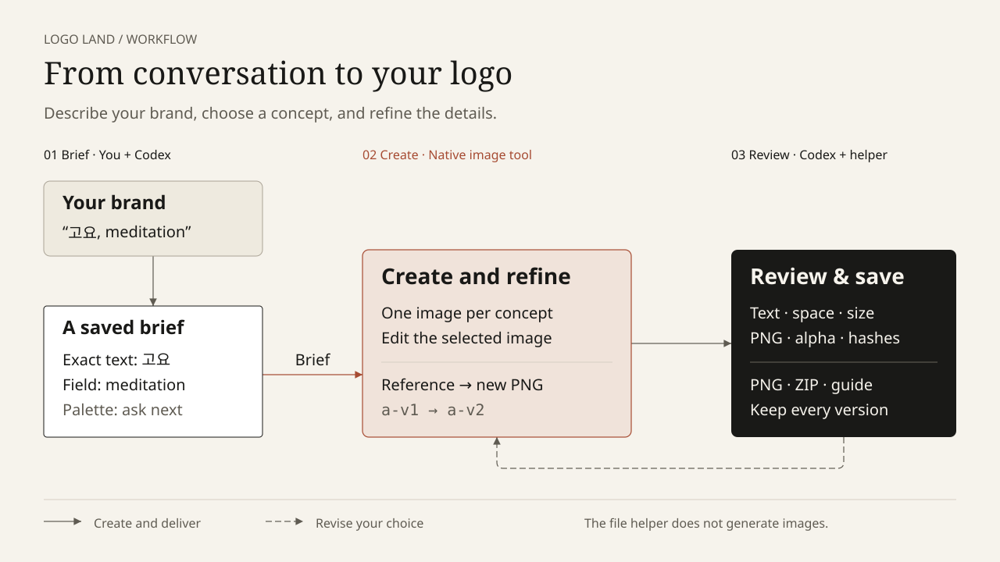

<p align="center">
  <a href="https://github.com/t1seo/logo-land/releases/tag/v0.3.1"></a>
  <a href="docs/qa/color-workflow/README.md"></a>
  
  
  
  <a href="README.md"></a>
  <a href="README.ko.md"></a>
</p>

# Logo Land

Version 0.4.0 is available in this source tree as an unreleased development update. The published release remains 0.3.1: required restricted-color and white-transparent live samples have not passed validation. [Current validation status](docs/qa/color-workflow/README.md).

<p align="center"></p>

[How we made this logo](docs/brand/README.md)

**Create, refine, and deliver logos through a conversation with Codex.** Describe your brand and the feeling you want, compare concepts, then refine your chosen image into a final PNG with a short brand guide. Logo Land saves originals and revision history so you can continue in another conversation.



[Workflow with a text explanation](docs/diagrams/workflow-en.html) · [Gallery of 10 samples](docs/samples/index.html)

GitHub displays HTML links as source code. After cloning the repository, open `docs/diagrams/workflow-en.html` or `docs/samples/index.html` in local Chrome to view the complete pages. The workflow SVG and sample PNGs display directly in this README.

## Get started

Use a Codex environment with access to native image generation and editing. Installing the plugin does not grant access to an unavailable image tool. Local file management requires Python 3.12+ and `uv`; the plugin does not require a separate OpenAI API key or accounts with competing logo services.

### Use the repository directly

```sh
git clone https://github.com/t1seo/logo-land.git
cd logo-land
uv sync --locked
codex
```

In a Codex conversation opened in that folder, ask it to read the skill instructions:

> Read skills/logo-land/SKILL.md and follow it to create a logo. The brand is Goyo, a meditation studio. Show me two calm concepts combining a symbol and the exact Korean text 고요.

### Install as a Codex plugin

The installation command is `codex plugin add`. This repository contains plugin source; it does not provide a public marketplace or a release ZIP as an installation route. You can register the checkout in your own local marketplace:

1. Clone the repository above and note its **absolute path**.
2. Create `.agents/plugins/marketplace.json` inside a separate marketplace folder. Replace `path` below with the checkout's actual absolute path. On Windows, use `/` in the JSON path.

```json
{
  "name": "logo-land-local",
  "plugins": [
    {
      "name": "logo-land",
      "source": {
        "source": "local",
        "path": "/absolute/path/to/logo-land"
      },
      "policy": {
        "installation": "AVAILABLE",
        "authentication": "ON_INSTALL"
      },
      "category": "Productivity"
    }
  ]
}
```

3. Register the marketplace root, the folder containing `.agents`, and install the plugin. Replace the placeholder path with your actual location.

```sh
codex plugin marketplace add /absolute/path/to/local-marketplace
codex plugin add logo-land@logo-land-local
```

4. Open a **new Codex conversation** and start with `$logo-land`. Enable the plugin if your environment requires it.

These commands follow Codex CLI `0.154.0` help for `codex plugin marketplace add --help` and `codex plugin add --help`. Check those help pages if your installed version differs. The [local installation record and verification limits](docs/qa/installation.md) also include records from before the rename.

## Use natural language

You do not need to complete a form before starting. Share the brand name, exact lettering, industry, desired feel, and intended use; Codex asks about the details that matter.

> $logo-land Create a logo for an eco-conscious design studio called Morrow Studio. Show me two concepts with a simple symbol and the brand name.

> Choose the second concept. Keep the shape and lettering, but change the color to navy.

> Make the chosen logo's background transparent, and create a separate icon-only version.

> Resume the saved morrow-live project and export the final PNG.

Concepts are generated as separate images. The default is three directions unless you specify another count. Revisions use the chosen image as their reference. You can also supply an existing logo image to work from.

## Choose colors in four ways

| Start with | Example request |
|---|---|
| Automatic selection | “Choose warm colors for SUNROOM, a neighborhood bakery. Choose for me and generate two concepts.” |
| A fixed anchor | “Keep exactly #247A52 in the GROVE symbol; suggest warmer companion colors.” |
| A restricted palette | “Use only #000000 and #F4EBDD, at most two visible design colors, on a transparent background.” |
| A reference image | “Use this attached photo to suggest TIDE's palette. Explain which colors came from the background.” |

You can combine these: “Use this photo, keep #247A52, use at most two colors, and choose for me.” Logo Land records the reference, fixed colors, allowed colors, required colors and maximum count together. Conflicting restrictions are resolved before generation. Named colors are translated into an explicit HEX proposal; structured input accepts `#RGB` or `#RRGGBB` sRGB values, with at most eight unique colors in each locked/allowed/required list. A gradient request conflicts with an allowed-color or count restriction.

When you delegate selection, Codex records its choice and reason and continues. Ask “show colors first” if you want to select a palette before generation. Palette alternatives do not multiply your requested number of concepts. An opaque background counts as a visible design color; transparency and preview backgrounds do not. Intentional white lettering remains part of the logo.

Every image keeps its own palette version. A green logo edited to navy retains navy in a later spacing-only edit; reselecting the green original restores its green intent. Color edits preserve the chosen parent, exact lettering, layout and requested background unless you ask to change them.

**Intended HEX values and sampled PNG colors are different evidence.** The report identifies its source image, palette, sampling scope, measured swatches, ΔE00 distances and limitations. A sampled pass is not a promise of exact pixels or print matching. Explicit locks, allowed sets, required colors or count limits enable strict export checks: mismatch blocks delivery; indeterminate or missing evidence requires color review. Unrestricted suggestions are advisory. Export checks the selected original again, and visual approval cannot override a strict failure. See the [color workflow](skills/logo-land/references/color-workflow.md) and [delivery checks](skills/logo-land/references/delivery-checks.md).

Local calculations use ColorAide after dependencies are installed; first-use setup may need network access. An already-connected Leonardo MCP can optionally suggest colors. Logo Land continues locally when it is absent or fails, and does not automatically install skills, launch MCP servers, or require a new account or MCP connection. See [provider boundaries](skills/logo-land/references/color-providers.md).

The [eight-case color and typography gallery](docs/colors/index.html) shows actual native image outputs, palette intent, full revision histories, and light/dark/128px previews. NORTHLINE, GROVE and TIDE passed their documented reviews and were exported. Other candidates retain their measured failures or indeterminate status; a color pass alone does not prove transparency or readable lettering. See the [verification record](docs/qa/color-workflow/README.md) for the exact outcomes.

| Brand | Color approach and layout | Actual generated PNG |
|---|---|---|
| NORTHLINE | Local automatic palette · stacked symbol + text |  |
| GROVE SUPPLY | Fixed green anchor · horizontal symbol + text · light surfaces |  |
| TIDE & TYPE | Colors sampled from a reference · horizontal symbol + text |  |

## Pair a symbol with exact lettering

> $logo-land Create a horizontal combination logo for NORTHLINE: a simple symbol on the left, the exact text “NORTHLINE” on the right, no slogan, and restrained geometric sans-serif lettering. Use Space Grotesk as a visual reference.

> $logo-land Create a stacked combination logo with a crescent symbol above the exact Korean text “밤결”. Center the lettering and use a calm Korean sans-serif appearance, with Noto Sans KR as a visual reference. Deliver a transparent PNG.

The saved lockup records horizontal or stacked layout, symbol position, text alignment and typography direction. Exact brand text and slogans are checked separately from font appearance. See the [typography guide](skills/logo-land/references/typography.md), [font research and licensing boundaries](docs/research/font-tools.md), and [structured shortlist](docs/research/font-shortlist.json).

A requested font is a **visual reference** for raster generation. It does not establish that a particular font file was used, that every glyph matches, or that editable typesetting or a font license is included. No font installation or external font MCP is required. Actual font-file work requires separate source, license and exact-character checks.

## Eight logo types

| Type | Form | Example request |
|---|---|---|
| Wordmark | The brand name is the logo | “Use only the Korean name 물결.” |
| Lettermark | Clearly readable initials | “Make the letters NL easy to recognize.” |
| Monogram | Combined or interwoven initials | “Interlock the two L letters into one shape.” |
| Symbol | A recognizable object or pictorial mark | “Use a fern silhouette with no lettering.” |
| Abstract | A concept expressed through shapes | “Suggest upward movement with simple geometry.” |
| Combination | Symbol and lettering together | “Pair the name 고요 with a calm circular symbol.” |
| Emblem | Lettering and a mark inside a badge | “Create a circular badge for a neighborhood bakery.” |
| Mascot | A character represents the brand | “Build the logo around a friendly cat character.” |

Type and style are separate choices. A wordmark can be minimal, serif, or handwritten in appearance. See the [logo direction guide](skills/logo-land/references/logo-directions.md).

## Ten real samples

These fictional brands were generated with the Codex native image tool. The [sample gallery](docs/samples/index.html) and [catalog](docs/samples/catalog.json) contain each request, prompt, review status, and delivered file. The previews below display the actual delivery PNGs at 240px wide.

The samples were created before the Logo Land rename, so their original requests still contain `$logo-generator`. Those records are preserved as created. Start new work with **`$logo-land`**.

| Brand | Logo type | Generated logo |
|---|---|---|
| **01 · LUMA** | Wordmark | <br>Black and ivory serif lettering<br>[Original PNG](docs/samples/items/01-luma/delivery/logo.png) |
| **02 · LOOP LAB** | Monogram | <br>Lime LL monogram<br>[Original PNG](docs/samples/items/02-loop-lab/delivery/logo.png) |
| **03 · 고요** | Combination | <br>Forest green symbol and Korean lettering<br>[Original PNG](docs/samples/items/03-goyo/delivery/logo.png) |
| **04 · BREAD & BLOOM** | Emblem | <br>Terracotta bakery badge<br>[Original PNG](docs/samples/items/04-bread-bloom/delivery/logo.png) |
| **05 · KITE** | Abstract | <br>Geometric shapes suggesting ascent<br>[Original PNG](docs/samples/items/05-kite/delivery/logo.png) |
| **06 · MISO** | Mascot | <br>Warm, friendly cat character<br>[Original PNG](docs/samples/items/06-miso/delivery/logo.png) |
| **07 · NORTHLINE** | Lettermark | <br>Clear NL initials<br>[Original PNG](docs/samples/items/07-northline/delivery/logo.png) |
| **08 · 물결** | Wordmark | <br>Blue Korean lettering<br>[Original PNG](docs/samples/items/08-mulgyeol/delivery/logo.png) |
| **09 · FERN** | Symbol | <br>A distinct botanical silhouette<br>[Original PNG](docs/samples/items/09-fern/delivery/logo.png) |
| **10 · NOVA NOTES** | Combination | <br>Burgundy art deco identity<br>[Original PNG](docs/samples/items/10-nova-notes/delivery/logo.png) |

## Transparent-background logos

Generate a logo on a transparent background from the start, or remove the background of an existing logo:

> $logo-land Create a logo for Goyo with the exact Korean text 고요. Deliver a transparent-background PNG with no white backing panel or shadow.

> Remove only this logo's background. Keep the lettering, colors, and shape, and deliver a transparent PNG.

Logo Land requests genuine PNG transparency, preserves intentional white foreground details, and checks actual transparent pixels before exporting. You can also request a solid-color background. The same PNG can be previewed on light and dark surfaces without changing its pixels.


[Transparent PNG](assets/logo-transparent.png) · [Light/dark preview](docs/transparency/index.html) · [Generation and verification](docs/transparency/README.md)

This example keeps the original black LAND lettering, so it is best suited to light backgrounds. Ask for a white-lettering variant when needed for dark surfaces.

## Revisions and delivery

Ask for changes to color, letterform appearance, spacing, proportions, symbols, backgrounds, or horizontal and stacked layouts. Each revision sends the selected original to the image tool and records a new image ID with its parent relationship. Earlier images and delivered packages are preserved.

The final delivery includes the **selected PNG, a ZIP, and a short brand guide**. The helper checks actual PNG format, dimensions, visible pixels, hashes, and background requirements. Codex opens the image to review lettering, margins, and recognition at the intended size. Transparent delivery requires actual transparent pixels; an alpha channel alone is insufficient. See the [delivery checks](skills/logo-land/references/delivery-checks.md).

Logos are **raster images**. The plugin does not provide editable SVG/EPS/AI files, vector paths, font files, or CMYK print files. Korean lettering and small text may need further correction, and a requested revision cannot guarantee pixel-for-pixel preservation of other elements. Trademark availability and exclusive rights require separate checks.

## Image generation and the file helper

| Component | Responsibility |
|---|---|
| Codex native image tool | Generate new logo images and edit an existing image using it as a reference |
| Codex conversation | Build the brief, compare concepts, follow the user's selection, and visually review results |
| Local Python helper | Prepare prompts, save sessions and image history, inspect PNGs, and package files |

**Running the helper alone does not generate a logo.** If the image tool is unavailable or fails, the failure and existing work are preserved. Sessions live in `.logo-generator/sessions/<id>/`; the default delivery path is `output/logo-generator/<id>/`.

The `logo-generator` names in these two storage paths are intentional compatibility paths for existing projects. The plugin, skill, and repository use `logo-land`; you do not need to move old project folders because of the rename.

These file management examples run from the repository root. `prompt` prints instructions for the image tool.

```sh
uv sync --locked
uv run --locked python skills/logo-land/scripts/logo_project.py --workspace . --help
uv run --locked python skills/logo-land/scripts/logo_project.py --workspace . init --session demo --brief skills/logo-land/assets/brief.example.json
uv run --locked python skills/logo-land/scripts/logo_project.py --workspace . prompt --session demo --concept 'A simple geometric monogram'
```

To use an installed plugin from another workspace, pass its root to `uv run --locked --project /absolute/path/to/logo-land python ...` and your project folder to the helper's `--workspace` option. The [project file guide](skills/logo-land/references/project-files.md) documents the full commands and JSON formats.

Development checks are available below. Their recorded results are linked under [Research and verification](#research-and-verification).

```sh
uv run --locked pytest
uv run --locked ruff check .
uv run --locked basedpyright
```

## Releases and versioning

This documentation targets the **unreleased v0.4.0 development source**. The latest [published release is v0.3.1](https://github.com/t1seo/logo-land/releases/tag/v0.3.1). The Release badge identifies that published version; the Development badge identifies this source tree. The [changelog](CHANGELOG.md), [validation record](docs/qa/color-workflow/README.md) and [release guide](docs/releases.md) explain the remaining publication requirements.

No v0.4.0 tag is published. The repository installation steps above use the current development source. GitHub's source archives are repository snapshots, not plugin installation packages.

Schema-1 projects remain readable: `show`, `list` and `prompt` do not rewrite their state. The first successful explicit mutation saves a verified `session.v1.backup.json` before atomically writing schema 2. Existing artifacts keep unknown structured color intent; the helper does not invent old HEX values or successful reports. Keep the backup and original PNGs. This is forward compatibility for old projects; **v0.3.1 is not promised to read schema 2**, and no automatic downgrade is provided. The [project file guide](skills/logo-land/references/project-files.md) explains migration and recovery boundaries.

## Research and verification

- [Research and implementation index](docs/README.md)
- [Five-service comparison and product decisions](docs/research/comparison.md)
- [Official feature research](docs/research/official-features.md)
- [Implementation plan](plans/logo-generator.md)
- [Automated check record](docs/qa/helper-tests.md)
- [Background variant checks](docs/qa/background-variants.md)
- [Color workflow plan](plans/logo-land-color-workflow.md)
- [Color workflow verification](docs/qa/color-workflow/README.md)
- [Runnable palette, reference, lockup, report and gallery examples](skills/logo-land/references/project-files.md)
- [Font tools and verified research boundaries](docs/research/font-tools.md)
- [Real image generation and revision verification](docs/qa/live/README.md)
- [Service screenshot gallery](docs/research/gallery.html)
- [Final verification record](docs/qa/final.md)

The research compares Looka, Brandmark, Tailor Brands, Fiverr Logo Maker, and Design.com. They inform the creation workflow; actual logo generation happens in Codex. Research and historical verification documents are primarily in Korean and may retain the earlier project name.

The workflows follow [diagram-design](https://github.com/cathrynlavery/diagram-design/tree/8d8b2993ee2256ee7dfc0eeb3b5713aba3b60792), with a [project-specific style guide](docs/diagrams/style-guide.md) and [document validation record](docs/diagrams/validation.md).
