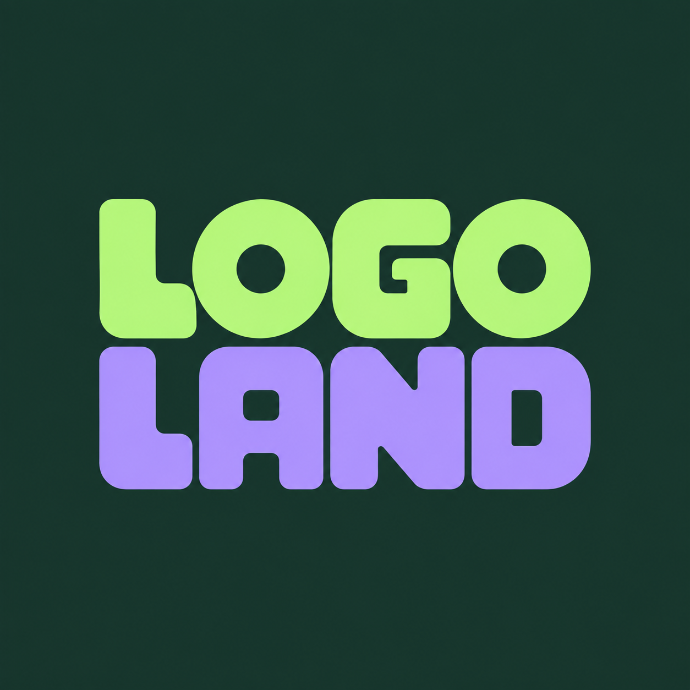

# Logo Land identity

[English](README.md) · [한국어](README.ko.md) · [Docs](../README.md) · [Logo Land](../../README.md)

**The letters are the logo.** Custom chunky lettering stacks **LOGO** above **LAND**, with mint on the first line and lilac on the second against deep ink. Rounded corners, generous letter shapes and tight spacing give the name its character.

  

[**Download the master PNG →**](../../assets/logo-land-wordmark.png) · [ZIP package](2026-lettering/delivery/logo-package.zip) · [Brand guide](2026-lettering/delivery/brand-guide.md) · [Showcase board](../../assets/logo-land-showcase.png) · [Current gallery](../gallery.md#showcase)

## Color direction

| Color | Design value | Role |
|---|---|---|
| Deep ink | `#17352B` | Dark foundation and badge base |
| Fresh mint | `#B9F582` | Bright primary accent |
| Lilac | `#B9A4FF` | Companion accent |
| Paper | `#F7F9F2` | Light supporting surface |

These HEX values define the brand’s design palette. The generated PNG has its own raster color variation; the values are not a claim that every pixel matches the palette exactly. Paper supports the documentation palette and is not the master image’s background.

## Try a similar request

> $logo-land Create one custom LOGO LAND wordmark. Put the exact word LOGO on the first line and LAND on the second. Use chunky rounded letterforms, close spacing, fresh mint for LOGO and lilac for LAND on deep ink. Make the lettering itself the design, without a separate symbol, slogan or extra text.

The current master is a raster PNG on an opaque dark background. Keep its proportions when displaying it. A transparent variant, editable vector and font file are not included.

## Earlier identities — archived

| Earlier design | Preserved files |
|---|---|
| Open-frame symbol and horizontal wordmark on ivory | [Original PNG](../../assets/logo-land-studio.png) · [Historical brand guide](2026-identity/delivery/brand-guide.md) |
| Earlier illustrated identity | [Historical identity record](legacy.md) · [Original PNG](../../assets/logo.png) |
| Earlier transparent revision | [PNG](../../assets/logo-transparent.png) · [Background-removal record](../transparency/README.md) |

Those guides, reviews and delivery files describe their respective earlier images. They are not provenance or delivery packages for the current lettering master.

[Transparent PNG example — GROVE](../samples/transparency.md) · [Lettering guidance](../../skills/logo-land/references/lettering.md)
