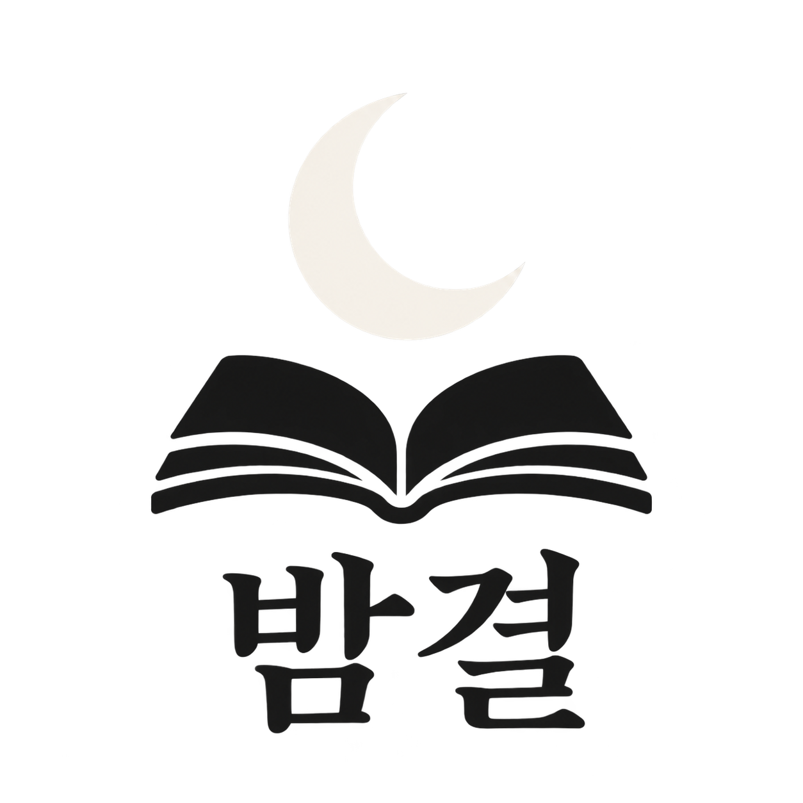

# 밤결

[English](README.md) · [한국어](README.ko.md) · [색상과 글자](../../README.ko.md) · [Logo Land](../../../../README.ko.md)

초승달과 책 심볼 아래에 정확한 한글 이름 밤결을 굵고 분명한 세리프 글자로 배치했습니다.

## 비슷하게 요청해 보세요

> $logo-land 정확한 한글 밤결 위에 초승달을 놓은 세로 조합 로고를 만들어 주세요. 투명 배경에 검정에 가까운 색과 아이보리를 사용해 주세요.

## 다운로드

[원본 PNG](../../assets/05-bamgyeol.png)

제한 색상 결과는 미확정 상태로 승인된 패키지가 없으며, 밝은 배경에서는 아이보리의 대비가 낮고 어두운 배경에서는 검은 글자의 대비가 낮습니다.

[변경 이력 보기 (로컬에서 열기)](index.html#artifact-a-v1)
