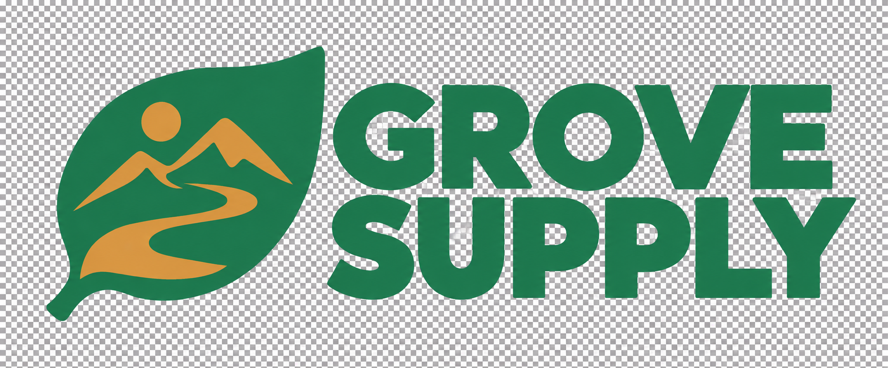

# GROVE SUPPLY

[English](README.md) · [한국어](README.ko.md) · [색상과 글자](../../README.ko.md) · [Logo Land](../../../../README.ko.md)

잎과 산책로를 표현한 심볼 옆에 굵은 GROVE / SUPPLY 글자를 놓은 원본과 따뜻한 색상 수정본입니다.

## 원본

[원본 PNG](../../assets/03-grove.png) · [ZIP 패키지](../../deliveries/grove/logo-package.zip) · [브랜드 가이드](../../deliveries/grove/brand-guide.md)

밝은 배경에 사용해 주세요. 기록된 색상 통과는 녹색 기준색에 대한 확인이며, 엄격한 두 색 제한 통과를 뜻하지는 않습니다.

## 따뜻한 색상 수정본

[따뜻한 색상 원본 PNG](../../assets/04-grove-warm.png)

이 시도에는 불투명 체크무늬가 이미지에 들어 있어 투명 배경 결과물로는 실패했으며, 해당 ZIP은 제작되지 않았습니다.

## 비슷하게 요청해 보세요

> $logo-land GROVE SUPPLY의 형태와 글자, 녹색 #247A52를 유지해 주세요. 보조색을 더 따뜻하게 바꾸고 배경은 투명하게 유지해 주세요.

[변경 이력 보기 (로컬에서 열기)](index.html) · [투명 로고 예제](../../../samples/transparency.ko.md)
