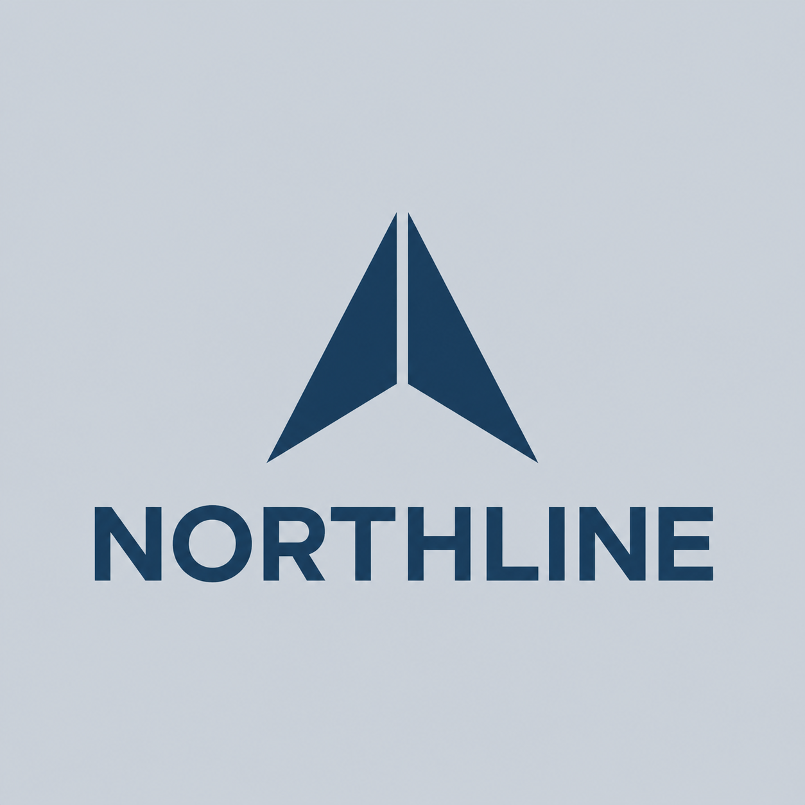

# NORTHLINE

[English](README.md) · [한국어](README.ko.md) · [Colors & typography](../../README.md) · [Logo Land](../../../../README.md)

A directional symbol above the full NORTHLINE name in geometric sans-serif lettering; the earlier [NL lettermark](../../../samples/items/07-northline/README.md) is a separate sample.

## Try a similar request

> $logo-land Create a stacked logo for NORTHLINE, with a directional symbol above the exact full name and a navy palette on opaque silver.

## Downloads

[Original PNG](../../assets/02-northline.png) · [ZIP package](../../deliveries/northline/logo-package.zip) · [Brand guide](../../deliveries/northline/brand-guide.md)

The lettering is raster artwork; its requested font appearance does not include a font file or license.

[Interactive history (open locally)](index.html#artifact-a-v1)
