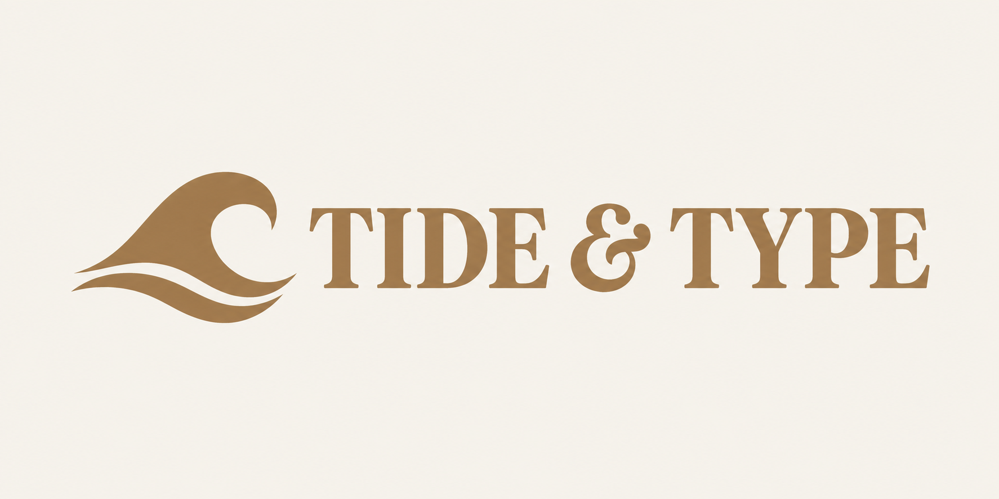

# TIDE & TYPE

[English](README.md) · [한국어](README.ko.md) · [Colors & typography](../../README.md) · [Logo Land](../../../../README.md)

A horizontal wave symbol and editorial serif TIDE & TYPE lettering, using [SUNROOM](../sunroom/README.md) as a color reference.

## Try a similar request

> $logo-land Use SUNROOM as a color reference for a horizontal TIDE & TYPE logo, with a wave symbol and expressive serif lettering on opaque ivory.

## Downloads

[Original PNG](../../assets/06-tide.png) · [ZIP package](../../deliveries/tide/logo-package.zip) · [Brand guide](../../deliveries/tide/brand-guide.md)

Fine serifs become small at 128 px; check the lettering at its intended display size.

[Interactive history (open locally)](index.html#artifact-a-v1)
