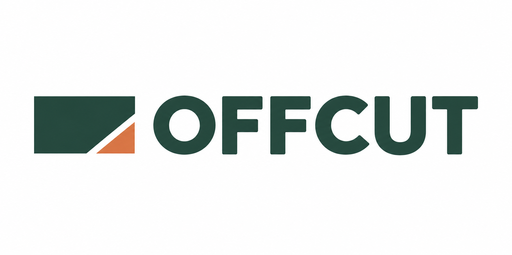
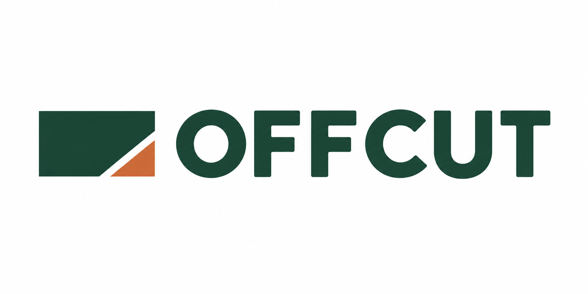

# OFFCUT · a Hermes example

[English](README.md) · [한국어](README.ko.md) · [Create with Hermes](../hermes.md)

Open [the offline example](index.html) in your browser to compare three real directions and exact-parent refinements for a fictional furniture studio. The page preserves the original white canvases, failed reviews and the coordinator’s sample choice.

| Direction | Original | Recorded review finding |
| --- | --- | --- |
| Useful Remainder | [c1 PNG](originals/c1.png) | Design requested more deliberate lettering spacing. |
| Repair Joint | [c2 PNG](originals/c2.png) | Critics requested cleaner background treatment and tighter framing. |
| Modular Shift | [c3 PNG](originals/c3.png) | Critics requested stronger joinery, tracking and small negative spaces. |

The coordinator chose **c1** for refinement. Its exact child [e1 PNG](originals/e1.png) improved FF/FC/UT spacing, but both model reviews found that the protected symbol-to-word gap narrowed. It remains a **needs revision** result.

The second edit used **e1** as its exact parent. [e2 PNG](originals/e2.png) restores the symbol-to-word gap while retaining the refined letter spacing; both new reviews passed all five criteria. The coordinator selected **e2**, and the native workflow delivered it at **revision 47**.

[Download the verified package](delivery/logo-package.zip) · [Read the brand guide](delivery/brand-guide.md) · [Export manifest](delivery/manifest.json)

The ZIP contains the exact e2 PNG, manifest and guide. ZIP SHA256: `0d1a4c2266ad6f04b3d1b78ab32c41b89ed5bd6c3b0c0d514fd580a9513d7c04`. Every linked PNG is byte-identical to its canonical original; no background, framing or artwork was edited for this page.

[The curated example record](example.json) contains allowlisted brief, lineage, feedback, model attribution and criteria. Reviews are separate model calls, not human certification. This static example does not resume a workflow.
