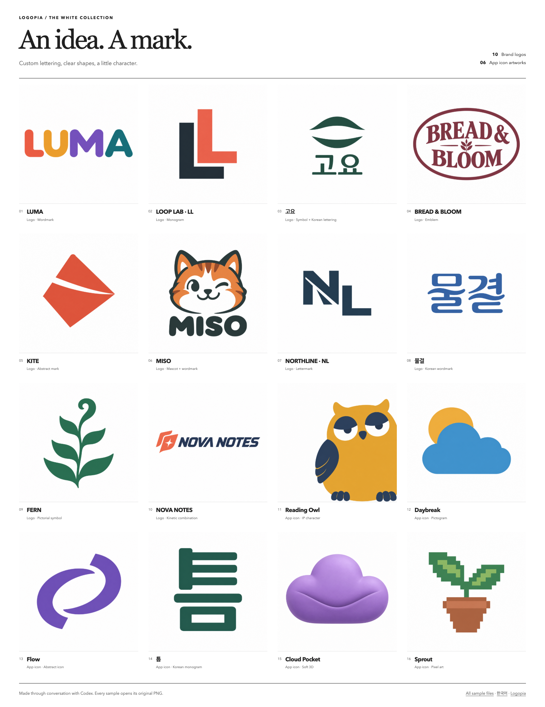

# 흰색 배경 컬렉션

[English](README.md) · [한국어](README.ko.md) · [Logopia](../../../README.ko.md) · [갤러리](../../gallery.ko.md#showcase)

흰색 배경으로 새로 만든 브랜드 로고 10개와 앱 아이콘 아트워크 6개입니다. [README에서 16개 샘플을 바로 보거나](../../../README.ko.md#샘플), 아래 PNG 링크로 원본을 열어 보세요.

## 원본 파일

| 이름 | 유형 | 파일 |
|---|---|---|
| LUMA | 워드마크 | [PNG](images/01-luma.png) · [프롬프트](sources/01-luma/revisions/a-v2/prompt.txt) |
| LOOP LAB · LL | 모노그램 | [PNG](images/02-loop-lab.png) · [프롬프트](sources/02-loop-lab/prompt.txt) |
| 고요 | 한글 조합형 | [PNG](images/03-goyo.png) · [프롬프트](sources/03-goyo/prompt.txt) |
| BREAD & BLOOM | 엠블럼 | [PNG](images/04-bread-bloom.png) · [프롬프트](sources/04-bread-bloom/revisions/a-v2/prompt.txt) |
| KITE | 추상형 | [PNG](images/05-kite.png) · [프롬프트](sources/05-kite/prompt.txt) |
| MISO | 마스코트 | [PNG](images/06-miso.png) · [프롬프트](sources/06-miso/prompt.txt) |
| NORTHLINE · NL | 레터마크 | [PNG](images/07-northline.png) · [프롬프트](sources/07-northline/prompt.txt) |
| 물결 | 한글 워드마크 | [PNG](images/08-mulgyeol.png) · [프롬프트](sources/08-mulgyeol/prompt.txt) |
| FERN | 심볼 | [PNG](images/09-fern.png) · [프롬프트](sources/09-fern/prompt.txt) |
| NOVA NOTES | 속도감 있는 조합형 | [PNG](images/10-nova-notes.png) · [프롬프트](sources/10-nova-notes/prompt.txt) |
| Reading Owl | IP 캐릭터 | [PNG](images/11-reading-owl.png) · [프롬프트](sources/11-reading-owl/prompt.txt) |
| Daybreak | 픽토그램 | [PNG](images/12-weather.png) · [프롬프트](sources/12-weather/revisions/a-v2/prompt.txt) |
| Flow | 추상형 아이콘 | [PNG](images/13-flow.png) · [프롬프트](sources/13-flow/prompt.txt) |
| 틈 | 한글 모노그램 | [PNG](images/14-notes.png) · [프롬프트](sources/14-notes/revisions/a-v2/prompt.txt) |
| Cloud Pocket | 소프트 3D | [PNG](images/15-cloud.png) · [프롬프트](sources/15-cloud/prompt.txt) |
| Sprout | 픽셀 아트 | [PNG](images/16-sprout.png) · [프롬프트](sources/16-sprout/prompt.txt) |

[로컬 HTML 갤러리](index.html) · [파일 매니페스트](manifest.json) · [Logopia 로고](../../brand/README.ko.md)

크기·파일 해시 등 실제 파일 정보는 매니페스트를 확인해 주세요. 로고와 아이콘은 래스터 PNG 아트워크이며, 편집 가능한 벡터·폰트 파일·플랫폼별 앱 아이콘 패키지는 별도 작업이 필요합니다. 흰색 배경은 이번 컬렉션의 요청이며, 모든 프로젝트의 기본 배경을 뜻하지는 않습니다.

[이전 컬러 쇼케이스](../2026-09/README.ko.md)는 당시 원본과 기록을 그대로 보관했습니다.

IP 캐릭터 지침은 [s1dashu/ip-as-logo-skill](https://github.com/s1dashu/ip-as-logo-skill)을 바탕으로 각색했습니다. [원본과 각색 안내](../../../skills/logo-land/references/ip-mascot.md) · [MIT 라이선스 고지](../../../skills/logo-land/assets/ip-as-logo.LICENSE)

## 다듬은 부분

네 샘플은 원본을 바탕으로 수정했습니다. LUMA의 대문자 M, BREAD & BLOOM의 밀 이삭, Daybreak의 둥근 해, 틈의 빠진 자음 획을 보완했습니다. [파일 목록](manifest.json)에 최종 프롬프트와 첫 원본을 연결했습니다. [시각 검수](visual-review.json)에는 실제 표시 크기별 관찰과 한계를, [배경 검사](background-checks.json)에는 흰색으로 보이는 원본의 미세한 픽셀 차이를 기록했습니다. 정확한 HEX 일치를 인증한 것은 아닙니다.
