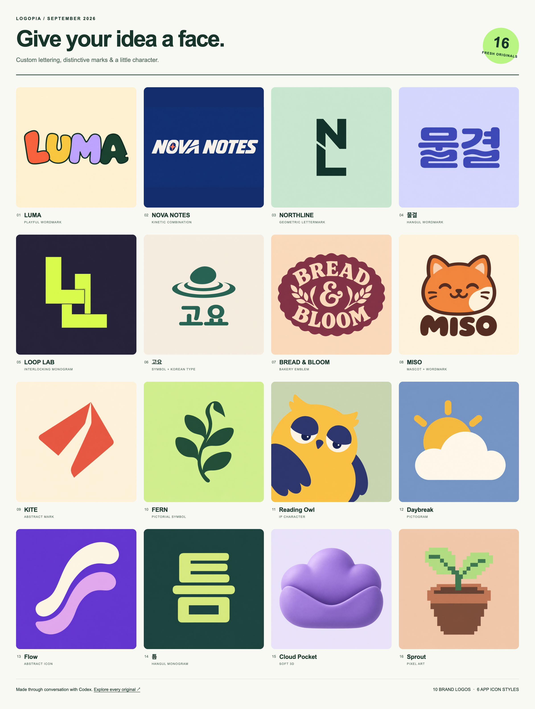

# 2026년 9월 샘플 모음

[Logopia](../../../README.ko.md) · [English](README.md) · [갤러리](../../gallery.ko.md)

기존 가상 브랜드 10개와 앱 아이콘 스타일 6종을 모두 새롭게 만들었습니다. 첫 줄에서는 다채로운 영문 글자형, 역동적인 워드마크, 기하학적인 이니셜, 한글 워드마크를 보실 수 있습니다.

## 개별 원본 받기

| 이름 | 디자인 방향 | 파일 |
|---|---|---|
| [LUMA](images/01-luma.png) | playful wordmark | [PNG](images/01-luma.png) · [생성 요청문](sources/01-luma/revisions/a-v2/prompt.txt) |
| [NOVA NOTES](images/10-nova-notes.png) | kinetic combination | [PNG](images/10-nova-notes.png) · [생성 요청문](sources/10-nova-notes/prompt.txt) |
| [NORTHLINE](images/07-northline.png) | geometric lettermark | [PNG](images/07-northline.png) · [생성 요청문](sources/07-northline/prompt.txt) |
| [물결](images/08-mulgyeol.png) | hangul wordmark | [PNG](images/08-mulgyeol.png) · [생성 요청문](sources/08-mulgyeol/revisions/a-v2/prompt.txt) |
| [LOOP LAB](images/02-loop-lab.png) | interlocking monogram | [PNG](images/02-loop-lab.png) · [생성 요청문](sources/02-loop-lab/prompt.txt) |
| [고요](images/03-goyo.png) | symbol + korean type | [PNG](images/03-goyo.png) · [생성 요청문](sources/03-goyo/prompt.txt) |
| [BREAD & BLOOM](images/04-bread-bloom.png) | bakery emblem | [PNG](images/04-bread-bloom.png) · [생성 요청문](sources/04-bread-bloom/prompt.txt) |
| [MISO](images/06-miso.png) | mascot + wordmark | [PNG](images/06-miso.png) · [생성 요청문](sources/06-miso/prompt.txt) |
| [KITE](images/05-kite.png) | abstract mark | [PNG](images/05-kite.png) · [생성 요청문](sources/05-kite/prompt.txt) |
| [FERN](images/09-fern.png) | pictorial symbol | [PNG](images/09-fern.png) · [생성 요청문](sources/09-fern/prompt.txt) |
| [Reading Owl](images/11-reading-owl.png) | ip character | [PNG](images/11-reading-owl.png) · [생성 요청문](sources/11-reading-owl/prompt.txt) |
| [Daybreak](images/12-weather.png) | pictogram | [PNG](images/12-weather.png) · [생성 요청문](sources/12-weather/prompt.txt) |
| [Flow](images/13-flow.png) | abstract icon | [PNG](images/13-flow.png) · [생성 요청문](sources/13-flow/prompt.txt) |
| [틈](images/14-notes.png) | hangul monogram | [PNG](images/14-notes.png) · [생성 요청문](sources/14-notes/prompt.txt) |
| [Cloud Pocket](images/15-cloud.png) | soft 3d | [PNG](images/15-cloud.png) · [생성 요청문](sources/15-cloud/prompt.txt) |
| [Sprout](images/16-sprout.png) | pixel art | [PNG](images/16-sprout.png) · [생성 요청문](sources/16-sprout/prompt.txt) |

[현재 Logopia 로고](../../brand/README.ko.md) · [Logopia 생성 요청문](../../brand/2026-logopia/prompt.txt) · [이전 Logo Land 로고](images/00-logo-land.png) · [로컬에서 여는 갤러리](index.html)

선택한 정사각형 원본은 **1254 × 1254 PNG**이며, NOVA NOTES는 **1536 × 1024**입니다. 모두 불투명 배경입니다. 한 판 이미지는 원본을 브라우저에서 배치한 미리보기입니다. 개별 로고가 필요하시면 위의 PNG 링크를 사용해 주세요. GitHub에서는 PNG와 Markdown 페이지를, 로컬에서는 HTML 갤러리를 여실 수 있습니다.

## 수정한 부분과 확인 결과

LUMA의 첫 결과에는 투명 배경이 생겨 이미지 도구로 크림색 배경을 복원했습니다. 물결의 첫 결과는 ㅜ의 아래 세로획이 빠져, 해당 획을 수정했습니다. 수정 전 원본도 보관했습니다: [LUMA a-v1](images/01-luma-a-v1.png) · [물결 a-v1](images/08-mulgyeol-a-v1.png).

부엉이의 눈에는 두 가지 캐릭터 색 외에 크림색이 들어갔으며, 일부 평면 스타일에는 미세한 질감이나 명암이 남아 있습니다. 픽셀 아트는 래스터 표현으로, 정확한 정수 격자를 보장하는 스프라이트는 아닙니다. 자세한 관찰 결과는 [검토 기록](visual-review.json)에 남겼습니다.

## 생성 기록

아래 기록은 이전 Logo Land 로고를 포함한 원래 컬렉션에 대한 것입니다. 원본과 기록을 보존했으며, 새 [Logopia 로고](../../brand/README.ko.md)의 생성 기록은 별도로 관리합니다. 현재 보드에는 새 이름을 표시했습니다.

내장 `image_gen__imagegen`으로 **대표 로고와 샘플 16개를 각각 생성**한 뒤, **두 번의 부분 수정**을 진행했습니다. [파일 목록](manifest.json)과 개별 기록에 실제 요청문, 세션·이미지 ID, 크기, SHA-256, 이미지 도구가 반환한 파일명을 보관했습니다. 도구가 모델 이름을 제공하지 않아 특정 모델을 사용했다고 표기하지 않았습니다.

[HTML 원본](index.html)은 실제 PNG를 CSS로 배치합니다. 이를 Chromium의 가로 1600 CSS 픽셀, 화면 배율 1.5 환경에서 캡처해 README의 한 판 이미지로 만들었습니다. [브라우저 확인 결과](../../qa/lettering-refresh/gallery-browser.json)에는 원본 열기와 모바일 표시 검증이 포함되어 있습니다. 스크립트로 로고를 다시 그리거나 색을 바꾸지는 않았습니다.

[과거 샘플과 갤러리](../../gallery.ko.md#historical-outputs)
