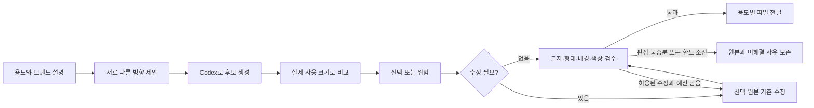

# Logo Land 개선 제안 — 생성부터 제품 적용까지

조사일: 2026-09-13 KST · 기준 소스: `06b94c41922973fc98392fadde25fff9aa498f6e` · 상태: 첫 단계 구현·검증·main 병합 완료

## 권장 방향

**사용자가 짧게 설명하면, 제품에 맞는 방향을 제안하고 선택한 디자인을 실제로 적용할 수 있는 파일까지 완성하는 도구**로 발전시키는 것을 권합니다. 우선순위는 ① 용도 중심 대화와 비교, ② 형태를 유지하는 수정과 정확한 조판, ③ 필요한 산출물 묶음입니다. 이미지 제작 엔진은 Codex 네이티브 이미지 생성을 유지합니다.

이번 조사는 현재 코드·기존 검수 기록·실제 PNG·공식 문서를 비교했습니다. 외부 서비스의 로그인 후 전체 제작 과정을 새로 실행하거나 품질 벤치마크를 수행한 것은 아닙니다. 아래 외부 기능은 해당 제공자의 설명이며, Logo Land에 그대로 구현되어 있다는 뜻은 아닙니다.

## 현재 기반과 실제 빈틈

| 영역 | 이미 있는 기능 | 개선할 부분 |
|---|---|---|
| 대화와 후보 | 필요한 질문만 하기, 기본 3개 개념, IP 3방향/6후보, 선택 후 수정 | 사용 용도별 목표와 선택 이유를 다음 수정까지 일관되게 연결하기 |
| 여러 작업의 비교 | 공개 통합 샘플 갤러리, 단일 세션용 `icon-gallery` | 여러 세션에서 병렬 생성한 후보를 일반 사용자가 하나의 비교 갤러리로 묶는 helper 경로 |
| 디자인 품질 | 6개 아이콘 스타일의 구성 지침, 원본 보존, 작은 크기 비교 | 추상·3D의 제품 관련성과 작은 크기에서의 식별력을 평가·수정하는 구체적인 흐름 |
| 글자 | 정확한 문자열 의도, 가로/세로 심볼+글자 배치 | 실제 폰트 파일로 조판하는 경로; 현재 폰트명은 외형 참고이고 결과는 래스터 |
| 색상·배경 | 자동/기준색/제한색/참고색, 색상 검사, 실제 알파 확인 | 엄격한 색상 요구를 생성형 래스터만으로 해결하기 어려울 때의 제작 경로 |
| 전달 | 검토된 PNG·ZIP·가이드, 수정 계보 | 웹 헤더·파비콘·프로필·플랫폼 아이콘처럼 용도별로 연결된 자산 |

현재 [SKILL.md](../skills/logo-land/SKILL.md), [글자 지침](../skills/logo-land/references/typography.md), [산출물 모델](../skills/logo-land/scripts/logo_helper/artifact_models.py)을 확인했습니다. 기존 [Chrome 비교](../docs/qa/app-icons/quality-comparison.md#gallery-phase-outcome)에서 픽토그램·모노그램·픽셀은 개선, 추상·3D는 장단점 혼재로 기록되어 있습니다. 이번에도 IP 부엉이·개선 추상·개선 3D 원본을 직접 보았으며, 추상의 뾰족한 연결부와 3D의 하트에 가까운 형태를 확인했습니다. 소수 샘플 관찰이므로 모든 생성 결과의 성능으로 일반화하지 않습니다.

색상 쪽은 [제한색·흰색 투명 결과 기록](../docs/qa/color-workflow/continuation-escalation.md)에 해결되지 않은 사례가 있습니다. 특히 흰색 결과의 정량 판정 불충분은 눈에 보이는 결함과 같은 뜻이 아닙니다. 검사를 느슨하게 통과시키거나 재생성을 계속하는 방식은 개선안으로 삼지 않습니다.

구체적인 작업 흐름의 빈틈도 있습니다. [병렬 생성 지침](../skills/logo-land/references/app-icons.md#native-candidates-and-comparison)은 후보별 세션을 요구하지만 [갤러리 CLI](../skills/logo-land/scripts/logo_helper/app_icon_cli.py)는 세션 하나를 받습니다. 여러 세션의 `(세션, 버전, 후보 ID)`를 명시적으로 모으는 비교 명령은 새 기능으로 제안할 수 있습니다. 기존 공개 통합 갤러리가 없다는 뜻은 아닙니다.

## 공식 자료에서 가져올 원칙

| 출처 | 확인한 내용 | Logo Land에 적용할 제안 |
|---|---|---|
| [Looka Brand Kit](https://looka.com/brand-kit/) | 선택한 로고의 색상과 어울리는 글꼴·패턴을 다른 브랜드 자료로 연결 | 확정 디자인 하나를 기준으로 소규모 웹/앱 자산 묶음 구성 |
| [Kittl 글자 편집](https://help.kittl.com/editing-and-design/text-settings-editing/) | 텍스트 상자/문자 단위로 폰트·굵기·크기·자간 편집 | 심볼은 유지하고 실제 글자를 조판하는 선택형 경로 |
| [Recraft 로고 생성](https://www.recraft.ai/docs/recraft-studio/image-generation/how-to-generate-a-logo) | 로고에 맞는 벡터 모델·스타일 선택 경로 | 매체에 맞는 제작 경로 구분. Recraft의 벡터 능력을 Codex PNG의 능력으로 간주하지 않기 |
| [Recraft Agentic mode](https://www.recraft.ai/docs/recraft-studio/image-generation/agentic-mode) | 대화 맥락으로 순차 작업을 진행하고 캔버스에서 결과 비교 | 다음 행동을 한 가지 추천하고, 수정 대상과 결과를 화면에서 명확하게 연결 |
| [Brandmark Logo Crunch](https://brandmark.io/logo-crunch/) | 작은 해상도에 맞춰 선·형태를 보정하고 실제 크기 비교 | 파비콘용 단순화 변형을 별도 디자인으로 관리. 기존 파일의 단순 축소와 구분 |
| [Recraft character consistency](https://www.recraft.ai/docs/best-practices/character-consistency) | 특징 설명·동일한 스타일·참고 이미지로 연속성 유지; 전용 캐릭터 추적 기능은 없다고 설명 | IP의 눈·실루엣·대표색을 기록하고 선택 원본을 참조한 변형에 사용 |
| [Android adaptive icons](https://developer.android.com/develop/ui/compose/system/icon_design_adaptive) | 전경·배경 레이어와 테마/마스크 대응 | 앱용 파일 제작 단계를 별도 설계; CSS 원형 미리보기와 실제 플랫폼 자산을 구분 |
| [Apple HIG](https://developer.apple.com/design/human-interface-guidelines/app-icons), [Icon Composer](https://developer.apple.com/icon-composer/) | 평면 이미지도 지원하며, 레이어 방식에서는 재질·배치·외형 조정 가능 | 대상 플랫폼/OS에 맞춰 평면 전달과 Composer 제작을 구분 |
| [Figma library guidance](https://help.figma.com/hc/en-us/articles/360041051154-Guide-to-libraries-in-Figma) | 컴포넌트·스타일·변수를 공유하고 수정 내용을 여러 파일에 전달 | 승인한 색상·문구·자산 버전에서 각 출력물을 파생 |

이는 기능/문서 비교에 기반한 제안입니다. 외부 도구의 자동 점수, 제작 속도, 상업적 성공을 검증했다는 의미는 아닙니다.

## 사용자 제작 워크플로

1. **용도부터 이해합니다.** 앱 아이콘, 브랜드 로고, 심볼+글자 중 요청에서 추론합니다. 제품 설명·정확한 문구·사용 위치가 이미 있으면 다시 묻지 않습니다. 앱과 웹을 함께 요청하면 공통 정체성을 가진 두 산출물을 계획합니다.
2. **표현이 다른 방향을 만듭니다.** 일반 로고는 기본 3개, IP는 기존 3방향/6후보를 유지하며 사용자가 지정한 수를 우선합니다. 독서 앱이라면 ‘책을 든 부엉이 / 책장 사이의 여백 / 독서 기록의 누적’처럼 의미와 형태가 달라야 합니다. 단순 색상 변주를 별도 개념으로 세지 않습니다.
3. **사용 장면에서 고르게 합니다.** 기존 32/64/128px 비교에 웹 헤더, 앱 홈 화면, 필요 시 16px 파비콘을 추가합니다. 각 후보에는 적합한 이유 하나와 눈에 보이는 약점 하나를 표시합니다. 사용자 지정 UI가 없으면 예시 배치임을 밝힙니다.
4. **좋아한 이유를 수정 기준으로 저장합니다.** ‘B의 열린 공간은 유지하고 선만 굵게’처럼 유지할 특징과 변경할 특징을 나눕니다. 기존 parent 계보를 사용하고, 수정 후 두 특징을 비교합니다. 래스터 편집의 형태 보존은 검토 대상이며 픽셀 단위 보장으로 표현하지 않습니다.
5. **필요한 것만 완성합니다.** 사용자가 고르거나 선택을 위임하면 해당 디자인의 필요한 변형을 준비합니다. 매 단계 승인 질문을 추가하지 않습니다. ‘빠르게 하나 골라 완성’은 위임을 적용하고, ‘같이 비교하며 만들기’는 선택 지점에서 의견을 받습니다.
6. **수정 한도와 재개를 분명히 합니다.** 예산은 실제 이미지 호출 횟수로 안내합니다. 기존 색상 수정 최대 2회 제한을 유지합니다. 이번 첫 범위에서는 미감 점수에 따른 자동 재생성을 추가하지 않고, 선택 후 요청받은 수정을 검토합니다. 중단된 호출은 완료 여부를 확인한 후 이어가며 결과를 확인할 수 없다고 몰래 재생성하지 않습니다.

후속 조판·자산 기능까지 완성했을 때의 목표 대화: “독서 기록 앱 ‘틈’의 앱 아이콘과 웹사이트 로고를 만들어 주세요. 차분하지만 귀여웠으면 합니다.” → 제품과 용도에서 3방향 도출 → 실제 크기 비교 → “두 번째를 사용하고 이름을 옆에 붙여 주세요.” → 분리 심볼 확보 → 웹 로고용 별도 의도/세션과 원본 ID·해시 연결 → 조판합니다. 현재 아이콘 부모에는 아이콘 의도가 상속되고 lockup이 충돌하므로 같은 parent를 지정하는 것만으로 가능한 전환이 아닙니다. 첫 개선 범위에서는 사용 장면 비교까지 제공하고, 이 전환은 후속 기능으로 만듭니다.

## 우선순위와 제안 범위

| 순서 | 개선 | 구체적인 변경 | 완료 판단 예시 |
|---|---|---|---|
| 1 | 용도 중심 대화·비교 | 제품/사용 위치/차별점/유지할 특징을 짧게 저장하고 후보·수정·미리보기에 사용 | 완성된 요청에 중복 질문 없음. 세 후보의 의미와 형태가 구분되고 선택한 이유가 다음 수정에 반영됨 |
| 1 | 여러 세션의 후보 비교 | 각 세션의 명시적 후보 목록을 읽어 기존 카드로 통합 표시. 웹 헤더/홈 화면 예시를 추가 | 서로 다른 두 세션의 동일한 `v1` ID도 충돌 없이 각 원본·프롬프트로 연결되고 입력 세션은 불변 |
| 1 | 스타일별 품질 점검 | 추상은 열린 공간·접합, 3D는 대상 식별·재질, 글자는 실제 판독, IP는 표정·실루엣을 따로 점검 | 관찰 이유가 있는 개선/유지/악화 판정. 큰 이미지가 예쁜데 작은 크기에서 실패한 후보도 그대로 확인 가능 |
| 2 | 심볼과 글자 분리 제작 | AI 심볼과 실제 폰트로 조판한 텍스트를 결합하는 선택형 경로. 가로·세로 배치는 조립으로 처리 | ‘틈 / TEUM’, 띄어쓰기·구두점이 정확하고 자간 변경에도 심볼 원본이 바뀌지 않음 |
| 2 | 사용 목적별 자산 묶음 | 웹: 헤더·투명 심볼·파비콘. 앱: 원본·플랫폼 준비 자료. IP: 요청 시 온보딩/빈 상태 표정 변형 | 모든 파일이 같은 선택 버전에서 파생되고 각 파일의 목적·검수 상태가 명확함 |
| 3 | 정밀 색상·벡터 정리 | 편집 가능한 단순 도형/텍스트부터 정확한 색 지정. 복잡한 래스터의 벡터화는 별도 적합성 검토 | SVG 확장자 안의 PNG를 벡터로 부르지 않음. 경로·색상·렌더링을 확인한 출력만 해당 기능 표시 |
| 3 | 신규 설치와 배포 범위 검증 | 이미 있는 개발/공개 버전 구분을 유지하고, 선택한 배포 범위로 새 설치를 검증 | 새 설치에서 README 예제가 실행됨. 미해결 공개 조건의 해결 또는 범위 변경이 기록됨 |

**가장 효과가 클 것으로 보는 기능은 심볼과 글자 분리 제작입니다.** 심볼이 마음에 들어도 브랜드명·자간을 수정하려고 전체 그림을 재생성하면 형태까지 달라질 수 있습니다. 실제 조판은 이 문제를 줄일 수 있지만, 현재 네이티브 생성 전용 경로와 별개의 기능 추가입니다. 기존 작업을 자동 전환하지 않고 사용자가 해당 제작 방식을 선택할 수 있게 해야 합니다.

첫 범위의 대화·품질 개선은 기존 `Brief.use_cases`, `assumptions`, `concept`, `changes`, 검토 `notes`를 우선 재사용합니다. 이미 존재하는 제품→소재→형태 지침이나 부모 상속을 새 기능으로 다시 만들지 않습니다. 새로 제공할 것은 여러 세션을 묶는 비교 경로, 사용 장면 미리보기, 그리고 실제 결함과 보존 특징이 연결된 짧은 수정 메모입니다. 색상 실패는 ‘목표색 불일치 / 배경 요구 불일치 / 표본 부족’을 구분하고 남은 수정 횟수와 다음 조치를 안내하면 사용자가 원인을 이해하기 쉽습니다.

조판 경로는 사용할 폰트 파일·출처·라이선스·문자 지원을 확인하고, 로컬에서 재현할 수 있어야 합니다. 심볼이 PNG인 조합은 여전히 래스터 심볼을 포함한다고 표시합니다. 임의의 이미지에서 글자/심볼을 완벽히 분리하거나 정확한 벡터를 복원할 수 있다고 약속하지 않습니다. 새 심볼 전용 결과 또는 사용자가 제공한 분리 자산이 먼저 필요합니다.

후속 조판에서는 실제 폰트 해시·웨이트·대체 글리프 여부·조판/렌더러 버전·배치 입력을 기록하고, 우선 고정된 로컬 환경의 재현성부터 확인합니다. 원문 정확성과 시각적으로 좋은 자간은 각각 검토합니다. 파생 파일 목록은 source ID/해시·생성 방식·실제 포맷·검수 상태를 갖도록 새로 설계하며 기존 세 파일 ZIP 계약을 유지합니다. 원본의 색상 검사 통과를 축소·조판된 파일에 자동 적용하지 않습니다. SVG의 지정 색과 PNG에서 측정한 색도 구분합니다.

앱 플랫폼 패키지는 대상에 따라 나눕니다. Apple의 평면 경로에서는 해당 이미지와 적용 조건을 검토하고, Icon Composer 또는 Android adaptive 경로에서는 실제 레이어를 준비합니다. 레이어가 필요한데 합쳐진 PNG만 있으면 필요한 전경을 별도로 제작·확인합니다. IP의 모서리 구도를 보존하되 플랫폼 마스크에 중요한 얼굴이 잘리는 경우 전용 변형을 만듭니다. Android 테마색은 사용자의 기기 설정에 따라 달라질 수 있어 브랜드 HEX 고정 요구와 별도로 설명합니다.

## 품질을 개선했다고 판단하는 방법

- 기존 다섯 비-IP 사례를 회귀 비교에 쓰되, 같은 사례에만 맞춘 개선을 막기 위해 공개 전 별도 신규 브리프를 포함합니다. IP의 기존 지침·저작자 표시·원본은 보존합니다.
- 첫 이미지 파일럿은 6스타일별 대표 브리프 하나에 후보 수를 명시적으로 1개로 지정하고, 현재/개선 지침으로 각각 한 번 생성하는 비교입니다. 총 12회 새 호출을 상한으로 잡되 요청 수/예산이 우선합니다. IP 지침을 변경하지 않으면 기존 IP 원본 보존만 확인하고 신규 2회 호출을 생략하여 10회로 줄입니다. 이는 스타일별 결과의 작은 사례 비교이며 기본 3후보/6후보 전체 워크플로 검증이나 통계적 우월성 주장이 아닙니다. 모든 결과를 보존하고 동일한 크기·배경에서 비교합니다.
- 취향/제품 적합성/형태 식별은 사용자 또는 위임받은 검토자의 관찰로 평가합니다. 정확한 문구·알파·파일 무결성·색상 규칙은 별도 기술 검사로 평가합니다. 둘을 합친 근거 없는 ‘품질 95점’은 만들지 않습니다.
- 별도의 전체 흐름 검증에서는 세 후보에서 선택 가능한 결과가 있었는지, 완료까지 실제 이미지 호출 수, 요청하지 않은 형태 변경, 문구 오류, 최종 파일 적용 성공 여부를 기록합니다. 첫 구현 범위는 기존 후보를 이용한 비교→선택→재개→수정 프롬프트 연결을 먼저 검증할 수 있습니다. 전체 네이티브 시나리오는 일반 로고 1건 기준 현재/개선 각각 3후보와 요청된 수정 최대 1회, 총 8회 상한의 별도 제안입니다. 이 예산은 앞의 이미지 파일럿 10~12회에 포함되지 않으며, 둘을 기본으로 동시에 실행하지 않습니다. 실패/결과 미확인 호출도 시도로 세고 개선 목표는 기준값을 먼저 측정한 뒤 정합니다.
- 크리에이티브 비교용 원본과 검수 완료 산출물은 기존처럼 구분합니다. 실패·판정 불충분을 승인으로 바꾸지 않으며, 테스트 통과가 이미지 품질이나 앱스토어 승인이라는 의미가 되지 않도록 합니다.

네이티브 도구가 실제로 노출하는 입력과 결과만 사용합니다. 모델·seed·정확한 크기 고정이나 작업 조회 API를 가정하지 않으며, 확인할 수 없는 호출은 미확인으로 보존합니다. 재개·새 세션으로 동일 요청의 소진된 수정 횟수를 초기화하지 않습니다. 기존 제한 안의 색상 복구, 새 사용자 수정 요청, 단순 미감 재생성은 따로 구분합니다.

## Orca로 구현할 때의 작업 분담

1. **조정자:** 범위·데이터 계약·호출 예산을 결정하고 사용자 피드백을 한곳에서 반영합니다. 프로젝트 기록을 바꾸는 주체를 하나로 유지합니다.
2. **병렬 작업 A/B:** A는 대화·콘셉트·스타일별 검토 지침, B는 기존 갤러리의 사용 장면 비교를 담당합니다. 공통 상태 스키마가 필요하면 먼저 조정자가 계약을 확정합니다.
3. **샘플 생성:** 통합된 프롬프트를 사용해 전담 작업자가 Codex 네이티브 호출과 원본 ID를 관리합니다. 다른 작업자는 생성 결과를 읽어 평가하며 같은 세션 파일을 동시에 쓰지 않습니다.
4. **검증:** 자동 검사는 상태·내보내기 회귀를, Chrome 검토는 실제 화면·원본 링크·작은 크기 비교를 확인합니다. 의미 있는 변경에는 기존 동작 고정 → 실패 사례 → 구현 → 실제 사용 검증을 적용합니다.
5. **후속 독립 작업:** 조판·웹 패키지를 다음 범위로 다루고, 플랫폼별 패키지/벡터 정리는 입력 자산과 검증 환경이 준비된 후 진행합니다. 공유 파일은 소유자를 지정하고 모든 검토용 임시 자원을 정리합니다.

첫 구현 범위는 위 표의 **순서 1 세 항목**으로 제한하는 것을 권합니다. 이후 **심볼+실제 글자 조판과 웹 자산 묶음**을 진행하면 사용자가 체감할 수 있는 변화가 큽니다. 모든 제작 요청마다 여러 에이전트를 호출할 필요는 없습니다. 일상 생성은 대화·이미지 호출·검수만으로 실행하고, Orca의 병렬 작업은 개발과 비교 연구에 활용합니다.

구현 착수 시 먼저 확인할 정적 불일치가 하나 있습니다. [글자 지침](../skills/logo-land/references/typography.md)은 legacy 부모의 미상 배치를 유지하도록 하지만, [resolve_intent](../skills/logo-land/scripts/logo_helper/intent.py)의 `inherited_lockup or state.brief.lockup`는 부모 값이 없을 때 최초 brief 배치로 돌아갈 수 있습니다. 이번에는 실행 재현하지 않았습니다. 기존 기대 동작을 확인하고 해당 조건을 재현하는 좁은 검사로 판단한 뒤 수정 범위를 정해야 합니다.

## 유지할 정체성과 범위

IP 지침은 [s1dashu/ip-as-logo-skill](https://github.com/s1dashu/ip-as-logo-skill)을 직접 참고한 적응본임을 계속 명시합니다. 현재 고정 참조는 `acb834c717bcd0a487c49732d08397ba280d690b`이며 [크레딧/라이선스](../THIRD_PARTY_NOTICES.md)를 유지합니다.

README는 현재의 짧은 영문 기본/한국어 별도 구성을 유지하고, 사용 예·샘플·지원 출력만 갱신합니다. 연구 근거와 내부 검수 기록을 README에 다시 늘리지 않습니다. 유료 생성 API 추가, 사이트 로그인 자동화, 전체 벡터 편집기, 모든 플랫폼의 일괄 지원은 우선 구현 범위에서 제외합니다.

위 내용은 연구 시점의 전체 개선 제안입니다. 아래 실행 범위는 후속 사용자 승인과 README/샘플 탐색 개선 요청을 반영합니다. 조판·플랫폼 패키지·벡터는 이후 단계로 유지합니다.

조사 조정은 Orca `run_c1973a103211`에서 현재 역량·외부 도구·플랫폼 인계의 3개 병렬 조사와 Metis 검토로 진행했습니다. 검토에서 지적된 실험 호출 수와 전체 흐름의 구분, 아이콘→웹 로고의 별도 의존성, 첫 단계의 새 기능 범위, 수정 루프 종료 조건을 이 제안에 반영했습니다. 이는 연구 검토이며 새 이미지 품질·구현·출시 승인 결과가 아닙니다.

## Approved execution scope

- User: implement the first improvements, improve README/docs, add native samples, remove repeated navigation to view samples; then commit, push and merge `main`.
- Branch: `feat/logo-land-gallery-workflow`; working directory remains the current checkout. Orca run: `run_6d505799b820`. Source base: `06b94c41922973fc98392fadde25fff9aa498f6e`.
- First milestone: read-only multi-session comparison for PNG brand logos and app artwork; explicit selection/preservation notes and actual-use previews; legacy null-lockup characterization/fix if reproduced. Keep existing exports, session schema, strict gates and IP prompt output compatible.
- New CLI: `compare-gallery --selection-file <json> --output <relative-dir>`. Input: `{ "title": "...", "items": [{ "session": "...", "revision": 1, "artifact": "v1", "rationale": "...", "preserve": "...", "change": "...", "observation": "..." }] }`. The last four texts default to empty, are length-bounded data, and never imply approval. Require 1–60 unique `(session, artifact)` pairs and current matching revision per item. Filenames use sequential indices, with exact source identities and original/prompt hashes in the manifest. No inference from bare artifact ID across sessions.
- The new gallery includes artwork, illustrative app-home/header/favicon contexts, 16/32/64/128px comparisons, light/dark surrounds, filters/reset, original and prompt downloads. Preserve originals byte-for-byte. HTML escapes all supplied text; no remote assets or active calls from user strings. Copyable source/decision text supports conversational resume without changing approval or calling a shell.
- README EN/KO: representative images visible directly near the top, each linked to its original; one link to a single visual Markdown gallery containing all existing/new sample originals without category-intermediate clicks. GitHub HTML source links must not pretend to be hosted interactive pages. Keep local portable HTML separately labeled. Preserve centered badges, English default, concise usage and mandatory IP attribution.
- Native additions: six independent initial samples (IP character, pictogram, abstract, Hangul monogram, soft 3D, and symbol+text brand logo) plus one targeted child edit each for abstract and soft 3D: eight scheduled calls, all originals kept. These demonstrate the workflow, not a controlled before/after model benchmark. No automatic artistic rerolls, API fallback, hidden image editing or forced approval. A failed/missing tool is recorded and surfaced rather than filled with a stand-in.
- Development metadata target: `0.6.0` with an unreleased changelog. Preserve actual public-release label until a separately validated release. Refresh personal plugin installation after source checks using the plugin-creator workflow.
- No new paid provider, font renderer, vectorizer, hosted service or platform SDK dependency. Native model/seed/size/polling capabilities are not invented.

## TODOs

- [x] T1 — Implement comparison and refinement continuity with protected existing behavior.
  - Parallel ownership A: new comparison modules/template/tests and CLI registration. Ownership B: `intent.py`, dedicated lockup tests, SKILL and relevant reference Markdown (no comparison source edits).
  - PIN existing single-session gallery/source bytes and explicit-parent lockup behavior; RED the cross-session duplicate-ID case and the null-parent-lockup discrepancy; GREEN narrowly. Include mixed brand/icon input, stale revisions, malformed/escaping/symlink paths, injected markup, publication interruption rollback, no approval bypass and immutable source state.
  - Manual channel: actual CLI-driven creation then `curl -i --fail http://127.0.0.1:8790/gallery/index.html`; downloaded originals/prompts must match input bytes. Continuity QA uses tmux real CLI show→prompt/review→show or independent bounded HTTP evidence against a real generated fixture. Every spawned resource has a teardown receipt.
  - Artifacts: `docs/qa/gallery-workflow/comparison.md`, `continuity.md`; focused tests, Ruff and basedpyright. Root reads the entire implementation delta before the gate.

- [x] T2 — Generate eight native sample artifacts and make README samples directly visible.
  - Native owner: `output/gallery-workflow-native/` working projects; durable public `docs/gallery-workflow/` originals/prompts/receipts and project snapshots. Read the updated Logo Land workflow, save exact prompts and IDs before each call, import the actual returned file, and inspect every original/child. No generated model identity claims.
  - Docs owner: README EN/KO, public documentation indexes/categories, new `docs/gallery.md` and `docs/gallery.ko.md`. Restructure with existing real images while generation runs; final new-image links depend on the native owner's delivered manifest. No fake placeholders, CSS-only generated logos or duplicated original storage solely for thumbnails.
  - Use the implemented comparison helper to publish the new mixed multi-session HTML to `docs/gallery-workflow/comparison/`; pair initial/child examples and retain all eight entries. Document real observations including mixed/worse results.
  - QA: README loads representative images at first visit; one click reaches every original in the visual gallery. Exact-byte source/download checks and real Chrome viewport checks are required in T4. Native call receipts record completed/failed/unknown and actual dimensions, not requested dimensions.

- [x] T3 — Integrate, update development metadata and refresh personal installation.
  - Update `.codex-plugin/plugin.json`, `pyproject.toml`, relevant version tests/lock and CHANGELOG for unreleased `0.6.0`; preserve published release truth. English default and EN/KO parity remain.
  - Run `uv run pytest -q`, `uv run ruff check .`, `uv run ruff format --check .`, `uv run basedpyright`, and `uv lock --check` with appropriate repository scopes if generated historical evidence contains formatting exceptions; disclose exact exclusions instead of broad silence.
  - Validate all public local Markdown/image links, new manifests/source bindings and original hashes. Refresh installation and run the installed helper with the new comparison command using a real fixture; no missing-image-tool claim is resolved by installation.
  - Artifact: `docs/qa/gallery-workflow/integration.md` and installation receipt. Temporary fixtures, owned servers and test sessions are removed.

- [x] T4 — Verify the actual Chrome sample journey and gallery controls.
  - One browser owner verifies rendered README EN/KO desktop/narrow width, visible sample thumbnails, one-click original and one-click all-sample navigation, the mixed comparison gallery's contexts/sizes/light-dark/filter/reset/copy actions and image/prompt downloads. Use real Google Chrome, preserving unrelated user tabs.
  - Probe malformed markup, selection identity after filtering, stale snapshots and repeated reload/back navigation; user-supplied text must not execute. Separate CSS previews from actual platform files, originals from derivatives and candidate notes from approval.
  - Screenshot evidence: `docs/qa/gallery-workflow/chrome/`; report: `docs/qa/gallery-workflow/chrome.md`. Keep only the user's requested final local gallery open; close owned QA tabs/ports/temp downloads and register any intentional retained user-viewing resource.

## Final Verification Wave

- [x] T5 — Complete five independent Orca reviews and resolve actual findings.
  - Apply `review-work`: goal, code, security, hands-on QA and context/attribution/release truth reviews run in parallel with read-only ownership. Each verifies concrete source/behavior via an actual manual channel, reuses completed broad-suite evidence where source hashes still match, and supplies artifacts plus cleanup.
  - Fix found defects under the same owning task with precise failing evidence, rerun affected checks, and obtain final PASS on all five perspectives. Artifacts under `docs/qa/gallery-workflow/review-*.md` and a concise `review-summary.md`.

- [x] T6 — Commit, push and merge the verified feature into main.
  - Review exact staged files, exclude private output/state and pre-existing research drafts, commit the feature and source proposal, push the branch, create a concrete PR if supported and merge to `main` using normal history (no force). User explicitly authorized commit/push/merge.
  - Verify remote merge SHA, local main sync, clean tracked worktree and exact public README/image references. No release publication is implied by the merge. Leave the final new gallery open in Chrome as requested by the established sample workflow.
  - Mark this Boulder work complete only after the merge and final receipts. Artifact: `docs/qa/gallery-workflow/final-delivery.md`; no unowned branch/worktree/process cleanup.
